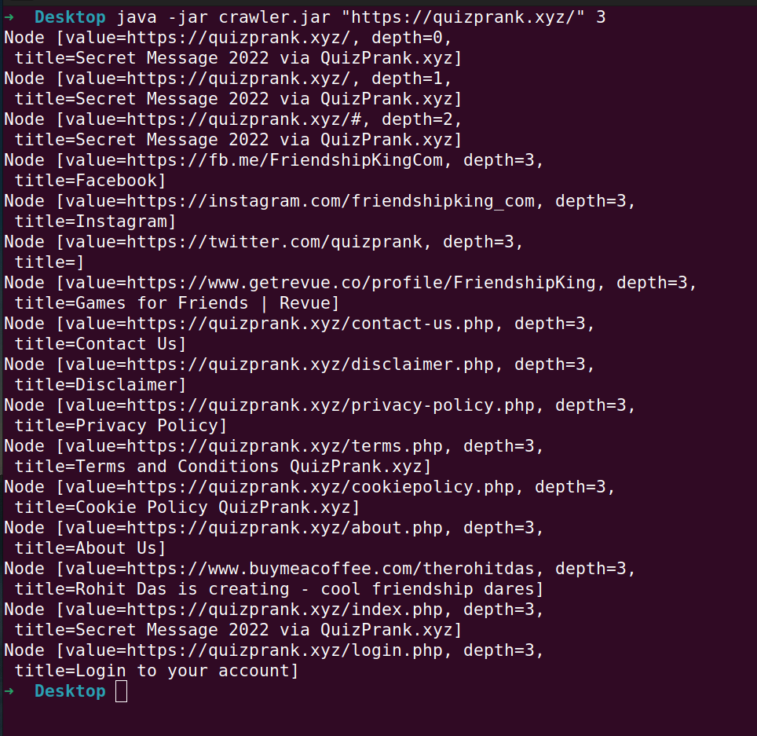

# A simple Web Crawler Bot in java 🕷️

This is a simple web crawler CLI app. You can use it search websites pages at a certain depth.

## Requirements 🪶️

To start using this crawler your system need to have JAVA 11 or above pre installed.

## How to use it 🤔️

Go to the jar folder. There you will get executable jar file, Or you can [click here](jar/crawler.jar) 

Download this jar file.

Then navigate to the folder where this jar file is.

Write command

```bash

java -jar crawler.jar <"site which you want to crawl"> <depth>

# Example 👇️

java -jar crawler.jar "https://quizprank.xyz/" 3

```

Then you will see output like this 👌️




